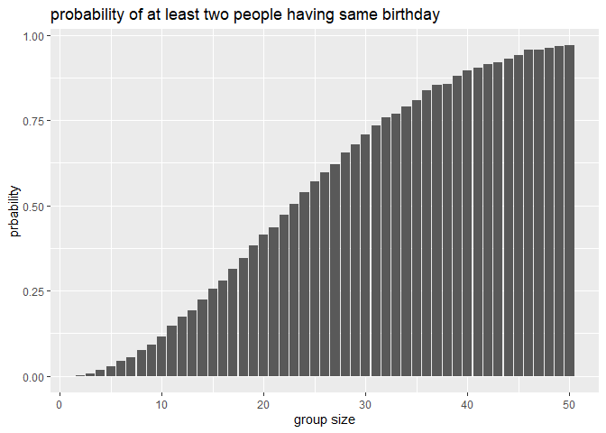
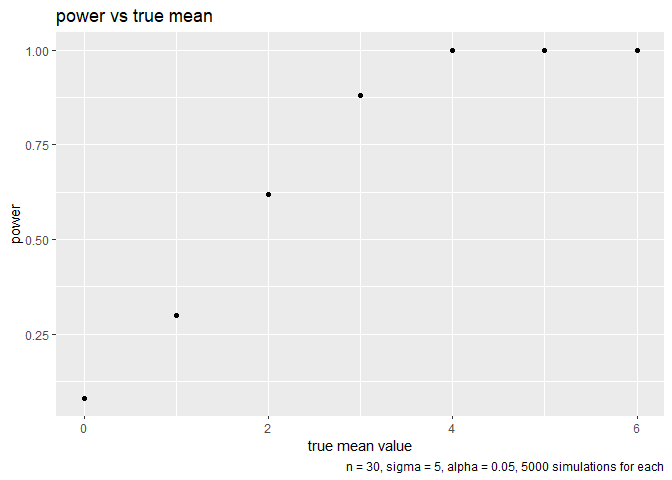
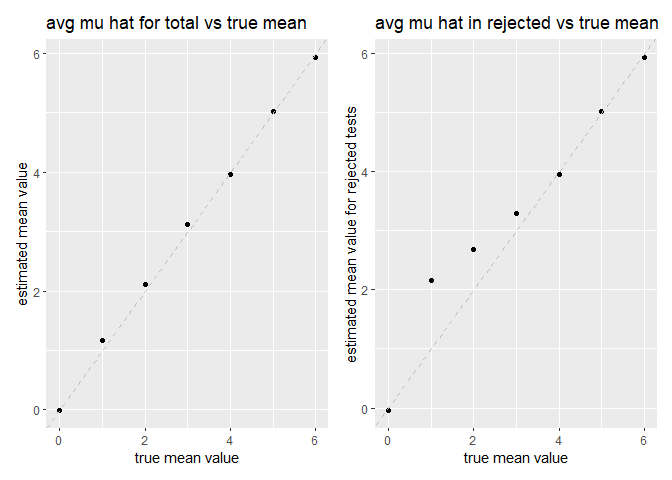
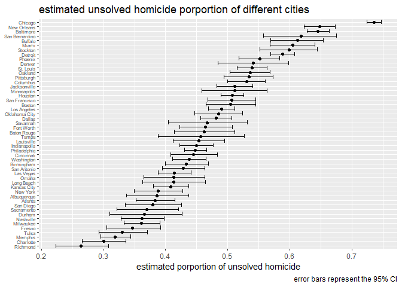

p8105_hw5_yl6109
================
Yurou Liu
2025-11-05

## Problem 1

``` r
# write function
bd_dup = function(n) {
  if (n <= 0){stop("input must be positive integer")}
  if (n > 365){return(TRUE)}
  birthday = sample(1:365, size = n, replace = TRUE)
  have_dup = any(duplicated(birthday))
  return(have_dup)
}

#simulation
bd_sim = function(num_of_sim, group_size_min, group_size_max){
  group_sizes = group_size_min:group_size_max
  prob = numeric(length(group_sizes))
  
  for (i in 1:length(group_sizes)){
    n = group_sizes[i]
    result = replicate(num_of_sim, bd_dup(n))
    prob[i] = mean(result)
  }
  
  result_df = tibble(
      group_size = group_sizes,
      probability = prob
    )
  return(result_df)
}

results = bd_sim(10000, 2, 50)
results %>% 
  ggplot(aes(x = group_size, 
             y = probability)) + 
  geom_col() + 
  labs(title = "probability of at least two people having same birthday", 
       x = "group size", 
       y = "prbability")
```

<!-- -->

According to the result_df and the plot, with group size increasing, the
probability of at least two person having same birthday increases and
get closer and closer to 1. The increasing rate of probability of at
least two person having same birthday (with respect to a unit increase
in group size) first increases and then start decreasing at the point
where group size is around 25.

## Problem 2

``` r
# simulation
n = 30
sigma = 5
mu_values = c(0, 1, 2, 3, 4, 5, 6)
n_sim = 50

results = data.frame()

for (mu in mu_values) {
  for (i in 1:n_sim) {
    x = rnorm(n, mean = mu, sd = sigma)
    t_test = t.test(x, mu = 0)
    tidy_result = broom::tidy(t_test)
    results = rbind(results, data.frame(mu_true = mu,
                                        mu_hat = tidy_result$estimate, 
                                        p_value = tidy_result$p.value, 
                                        rejected = tidy_result$p.value < 0.05))
  }
}

# df for plots
p2_plot_df = results %>% 
  group_by(mu_true) %>% 
  summarise(power = mean(rejected), 
           mean_mu_hat = mean(mu_hat), 
           rejected_mean_mu_hat = mean(mu_hat[rejected == TRUE]))

# draw plot

# power vs true mean
p2_plot_df %>% 
  ggplot(aes(x = mu_true, 
             y = power)) + 
  geom_point() + 
  labs(title = "power vs true mean",
       x = "true mean value",
       y = "power", 
       caption = "n = 30, sigma = 5, alpha = 0.05, 5000 simulations for each")
```

<!-- -->

When true mean equals 0, 1, 2, 3, the power increases as true mean
(effect size) increases. After true mean reaches 4, the power gets close
to 1.

``` r
# avg mu hat for total (and avg mu hat in rejected) vs true mean
p22 = p2_plot_df %>% 
  ggplot(aes(x = mu_true, 
             y = mean_mu_hat)) + 
  geom_point() + 
  geom_abline(intercept = 0, slope = 1, linetype = "dashed", color = "gray") +
  labs(title = "avg mu hat for total vs true mean",
       x = "true mean value", 
       y = "estimated mean value")

p23 = p2_plot_df %>% 
  ggplot(aes(x = mu_true,
             y = rejected_mean_mu_hat)) + 
  geom_point() + 
  geom_abline(intercept = 0, slope = 1, linetype = "dashed", color = "gray") +
  labs(title = "avg mu hat in rejected vs true mean" ,
       x = "true mean value", 
       y = "estimated mean value for rejected tests")

combined_plot = p22 + p23
combined_plot
```

<!-- -->
Part of the sample average of mu hat (estimated mean value) across tests
for which the null is rejected is not approximately equal to the true
value of true mean value, because when null is rejected, it means that
the observed result would be unlikely (estimated mean value far from
hypothesized value under null(0)) if the null hypothesis was true,
especially when true mean is close to null, which leads the sample
average of mu hat (estimated mean value) far from true mean.

## problem 3

``` r
# deal with data
homicide_df = read_csv("./data/homicide-data.csv") %>% 
  janitor::clean_names() %>% 
  mutate(city_state = paste(city, state, sep = ", "))
```

    ## Rows: 52179 Columns: 12
    ## ── Column specification ────────────────────────────────────────────────────────
    ## Delimiter: ","
    ## chr (9): uid, victim_last, victim_first, victim_race, victim_age, victim_sex...
    ## dbl (3): reported_date, lat, lon
    ## 
    ## ℹ Use `spec()` to retrieve the full column specification for this data.
    ## ℹ Specify the column types or set `show_col_types = FALSE` to quiet this message.

``` r
homicide_summary = homicide_df %>% 
  group_by(city) %>% 
  summarize(total_homicides = n(), 
            unsolved_homicides = sum(disposition %in% c("Closed without arrest", "Open/No arrest"))) %>% 
  print()
```

    ## # A tibble: 50 × 3
    ##    city        total_homicides unsolved_homicides
    ##    <chr>                 <int>              <int>
    ##  1 Albuquerque             378                146
    ##  2 Atlanta                 973                373
    ##  3 Baltimore              2827               1825
    ##  4 Baton Rouge             424                196
    ##  5 Birmingham              800                347
    ##  6 Boston                  614                310
    ##  7 Buffalo                 521                319
    ##  8 Charlotte               687                206
    ##  9 Chicago                5535               4073
    ## 10 Cincinnati              694                309
    ## # ℹ 40 more rows

The raw data contains 12 variables (uid, reported_date, victim_last,
victim_first, victim_race, victim_age, victim_sex, city, state, lat,
lon, disposition) and 52179 observations, which shows the homicide cases
across 50 cities (28 states) from 2007 to 2017. Victim races include
black, Hispanic, white, unknown, other and Asian. Victim ages from 0 to
102.

``` r
# prop test for Baltimore and pull values
btm_df = homicide_summary %>% 
  filter(city == "Baltimore")

result_baltimore = prop.test(
  x = pull(btm_df, unsolved_homicides), 
  n = pull(btm_df, total_homicides)
  )

tidy_prop = tidy(result_baltimore) %>% 
  print()
```

    ## # A tibble: 1 × 8
    ##   estimate statistic  p.value parameter conf.low conf.high method    alternative
    ##      <dbl>     <dbl>    <dbl>     <int>    <dbl>     <dbl> <chr>     <chr>      
    ## 1    0.646      239. 6.46e-54         1    0.628     0.663 1-sample… two.sided

``` r
estimated_prop = pull(tidy_prop, estimate)
conf_low = pull(tidy_prop, conf.low)
conf_high = pull(tidy_prop, conf.high)

# for each city, prop test
city_results = homicide_summary %>% 
  mutate(
    test_result = map2(unsolved_homicides, total_homicides, 
                       ~tidy(prop.test(x = .x, n = .y)))) %>% 
  unnest(test_result) %>%
  select(city, estimate, conf.low, conf.high, total_homicides, unsolved_homicides) %>%
  print()
```

    ## # A tibble: 50 × 6
    ##    city        estimate conf.low conf.high total_homicides unsolved_homicides
    ##    <chr>          <dbl>    <dbl>     <dbl>           <int>              <int>
    ##  1 Albuquerque    0.386    0.337     0.438             378                146
    ##  2 Atlanta        0.383    0.353     0.415             973                373
    ##  3 Baltimore      0.646    0.628     0.663            2827               1825
    ##  4 Baton Rouge    0.462    0.414     0.511             424                196
    ##  5 Birmingham     0.434    0.399     0.469             800                347
    ##  6 Boston         0.505    0.465     0.545             614                310
    ##  7 Buffalo        0.612    0.569     0.654             521                319
    ##  8 Charlotte      0.300    0.266     0.336             687                206
    ##  9 Chicago        0.736    0.724     0.747            5535               4073
    ## 10 Cincinnati     0.445    0.408     0.483             694                309
    ## # ℹ 40 more rows

``` r
# draw plot
city_results %>% 
  mutate(city = fct_reorder(city, estimate)) %>% 
  ggplot(aes(x = estimate, 
             y = city)) + 
  geom_point() + 
  geom_errorbar(aes(xmin = conf.low, 
                    xmax = conf.high)) + 
  labs(title = "estimated unsolved homicide porportion of different cities", 
       x = "estimated porportion of unsolved homicide",
       y = NULL, 
      caption = "error bars represent the 95% CI") + 
  theme(axis.text.y = element_text(size = 6))
```

<!-- -->
